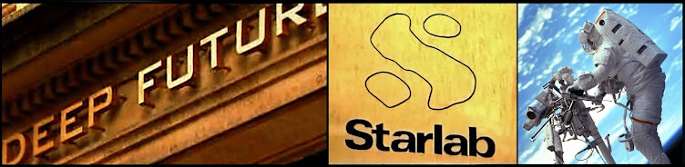

  

Frontier AI evaluation · Quantum machine learning · Superconducting quantum benchmarks

> Our research program builds falsification frameworks and reproducible evaluation harnesses for testing claims in frontier AI evaluation, alignment testing, adaptive quantum networks, quantum machine learning, and quantum hardware. 
>
> Current work focuses on structural AI metrics, continuation-risk measurement, national-security benchmarking, quantum kernel methods, recursive self-improvement, space telemetry anomaly detection, and superconducting-qubit benchmarks.

[Frontier AI Research Lab](https://lab.christopheraltman.com) ・ [Continuation Observatory](https://continuationobservatory.org) ・ [Personal Website](https://christopheraltman.com) ・ [Google Scholar](https://scholar.google.com/citations?user=tvwpCcgAAAAJ) ・ [Email](mailto:x@christopheraltman.com)

[Backpropagation Training in Adaptive Quantum Networks](https://link.springer.com/article/10.1007/s10773-009-0103-1) *International Journal of Theoretical Physics*

[Superpositional Quantum Network Topologies](https://link.springer.com/article/10.1007/s10773-004-7709-0) *International Journal of Theoretical Physics*

[Detecting Intrinsic and Instrumental Self-Preservation in Autonomous Agents: The Unified Continuation-Interest Protocol
](https://arxiv.org/abs/2603.11382) arXiv:cs.AI/2603.11382

[Wigner's Friend as a Circuit: Inter-Branch Communication Witness Benchmarks on Superconducting Quantum Hardware
](https://arxiv.org/abs/2601.16004) arXiv:quant-ph/2601.16004

[Accelerated Training Convergence in Superposed Quantum Networks](https://www.researchgate.net/publication/237711338_Accelerated_training_convergence_in_superposed_quantum_networks) NATO Advanced Study Institute on Mining Massive Data Sets for Security

[Astronaut Development and Deployment of a Secure Quantum Space Channel Prototype](https://www.academia.edu/84332651/Astronaut_Development_and_Deployment_of_a_Secure_Quantum_Space_Communications_Network) NASA Innovative Advanced Concepts Phase I proposal, [DARPA Quiness](https://www.darpa.mil/research/programs/quiness), [PISCES](https://pacificspacecenter.com/)

[Quantum State Engineering with the rf-SQUID](https://arxiv.org/abs/quant-ph/0307101) NATO Advanced Research Workshop on Quantum Chaos

<!--
**christopher-altman/christopher-altman** is a ✨ _special_ ✨ repository 

- 🔭 I’m currently working on ...
- 🌱 I’m currently learning ...
- 👯 I’m looking to collaborate on ...
- 🤔 I’m looking for help with ...
- 💬 Ask me about ...
- 📫 How to reach me: ...
- 😄 Pronouns: ...
- ⚡ Fun fact: ...
-->

